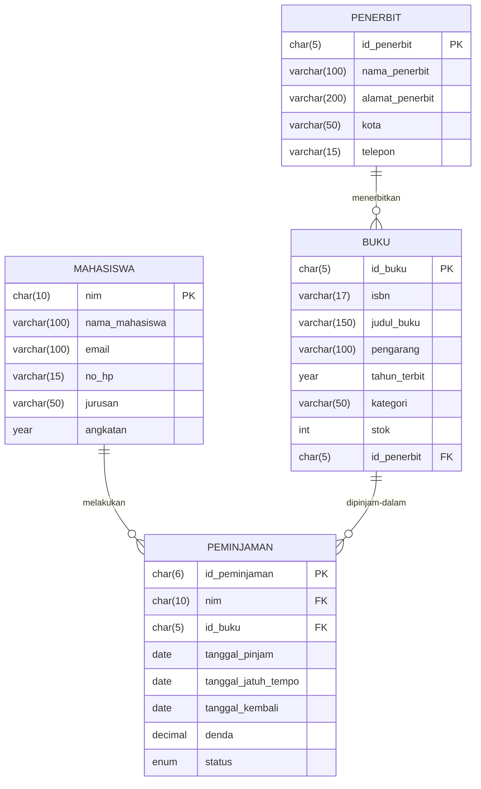

<div align="center">

# 📚 Perancangan ERD E-Library Kampus

### Tugas Mandiri — Modul 6 · Pemrograman Website


**Perancangan Basis Data Relasional untuk Sistem Peminjaman Buku Perpustakaan Kampus**

[📋 Spesifikasi](#-spesifikasi-sistem) · [🧩 ERD Logis](#-desain-erd-logis) · [🔄 Normalisasi](#-simulasi-normalisasi) · [🗃️ Tabel Akhir](#️-rancangan-tabel-akhir) · [📊 Diagram](#-visualisasi-relasi-kunci)

</div>

---

> **Skenario**
> Merancang basis data relasional untuk sistem peminjaman buku perpustakaan kampus.
> Sistem mencatat data **mahasiswa**, **buku**, **penerbit**, serta **riwayat peminjaman dan pengembalian**.

---

## 📑 Daftar Isi

<details open>
<summary><b>Klik untuk membuka / menutup daftar isi</b></summary>

1. [Spesifikasi Sistem](#-spesifikasi-sistem)
2. [Identifikasi Entitas & Atribut](#-identifikasi-entitas--atribut)
3. [Desain ERD Logis](#-desain-erd-logis)
4. [Simulasi Normalisasi (UNF → 1NF → 2NF → 3NF)](#-simulasi-normalisasi)
5. [Rancangan Tabel Akhir](#️-rancangan-tabel-akhir)
6. [Visualisasi Relasi Kunci](#-visualisasi-relasi-kunci)
7. [Bonus: Skrip SQL DDL](#-bonus-skrip-sql-ddl)
8. [Riwayat Pengerjaan (Commit)](#-riwayat-pengerjaan-commit)

</details>

---

## 📋 Spesifikasi Sistem

Sistem E-Library Kampus memiliki kebutuhan fungsional sebagai berikut:

| No | Kebutuhan Fungsional |
|:--:|:---------------------|
| 1 | Mencatat data mahasiswa yang terdaftar sebagai anggota perpustakaan |
| 2 | Mencatat data buku beserta informasi penerbitnya |
| 3 | Mencatat transaksi peminjaman buku oleh mahasiswa |
| 4 | Mencatat tanggal pengembalian dan denda keterlambatan |
| 5 | Menyediakan riwayat peminjaman per mahasiswa dan per buku |

> [!IMPORTANT]
> **Aturan bisnis utama:**
> - Satu mahasiswa dapat melakukan **banyak** peminjaman.
> - Satu buku dapat dipinjam **berkali-kali** (pada waktu yang berbeda).
> - Satu penerbit dapat menerbitkan **banyak** buku, tetapi satu buku hanya diterbitkan oleh **satu** penerbit.

---

## 🧬 Identifikasi Entitas & Atribut

Berdasarkan skenario, teridentifikasi **4 entitas utama**:

| Entitas | Deskripsi | Kunci Utama |
|:--------|:----------|:------------|
| 🎓 **Mahasiswa** | Anggota perpustakaan yang meminjam buku | `nim` |
| 📖 **Buku** | Koleksi buku yang tersedia di perpustakaan | `id_buku` |
| 🏢 **Penerbit** | Perusahaan penerbit buku | `id_penerbit` |
| 🔄 **Peminjaman** | Transaksi peminjaman & pengembalian buku | `id_peminjaman` |

---

## 🧩 Desain ERD Logis

### 🎓 Entitas: Mahasiswa

| Atribut | Keterangan | Tipe Kunci |
|:--------|:-----------|:----------:|
| `nim` | Nomor Induk Mahasiswa (unik) | 🔑 **PK** |
| `nama_mahasiswa` | Nama lengkap mahasiswa | — |
| `email` | Alamat email aktif | — |
| `no_hp` | Nomor telepon yang bisa dihubungi | — |
| `jurusan` | Program studi / jurusan | — |
| `angkatan` | Tahun angkatan mahasiswa | — |

### 📖 Entitas: Buku

| Atribut | Keterangan | Tipe Kunci |
|:--------|:-----------|:----------:|
| `id_buku` | ID unik buku | 🔑 **PK** |
| `isbn` | Nomor ISBN buku | — |
| `judul_buku` | Judul buku | — |
| `pengarang` | Nama penulis buku | — |
| `tahun_terbit` | Tahun buku diterbitkan | — |
| `kategori` | Kategori / genre buku | — |
| `stok` | Jumlah eksemplar tersedia | — |
| `id_penerbit` | Referensi ke entitas Penerbit | 🔗 **FK** |

### 🏢 Entitas: Penerbit

| Atribut | Keterangan | Tipe Kunci |
|:--------|:-----------|:----------:|
| `id_penerbit` | ID unik penerbit | 🔑 **PK** |
| `nama_penerbit` | Nama perusahaan penerbit | — |
| `alamat_penerbit` | Alamat kantor penerbit | — |
| `kota` | Kota domisili penerbit | — |
| `telepon` | Nomor telepon penerbit | — |

### 🔄 Entitas: Peminjaman

| Atribut | Keterangan | Tipe Kunci |
|:--------|:-----------|:----------:|
| `id_peminjaman` | ID unik transaksi | 🔑 **PK** |
| `nim` | Referensi ke Mahasiswa | 🔗 **FK** |
| `id_buku` | Referensi ke Buku | 🔗 **FK** |
| `tanggal_pinjam` | Tanggal buku dipinjam | — |
| `tanggal_jatuh_tempo` | Batas waktu pengembalian | — |
| `tanggal_kembali` | Tanggal aktual pengembalian (`NULL` jika belum kembali) | — |
| `denda` | Denda keterlambatan (Rp) | — |
| `status` | `DIPINJAM` / `KEMBALI` | — |

### 🔗 Kardinalitas Relasi

```
PENERBIT (1) ───< menerbitkan >─── (N) BUKU
MAHASISWA (1) ───< melakukan >─── (N) PEMINJAMAN
BUKU (1) ───< dipinjam dalam >─── (N) PEMINJAMAN
```

> [!NOTE]
> Entitas **Peminjaman** berperan sebagai *associative entity* yang memecah relasi *many-to-many* antara Mahasiswa dan Buku menjadi dua relasi *one-to-many*.

---

## 🔄 Simulasi Normalisasi

Normalisasi dilakukan bertahap: **UNF → 1NF → 2NF → 3NF**, berdasarkan data mentah formulir peminjaman.

### 📄 Tahap 0 — UNF (Unnormalized Form)

Formulir peminjaman mentah berisi kelompok data berulang (*repeating group*) — satu mahasiswa meminjam beberapa buku sekaligus:

| nim | nama_mahasiswa | jurusan | id_buku | judul_buku | pengarang | nama_penerbit | kota_penerbit | tgl_pinjam | tgl_kembali |
|:----|:---------------|:--------|:--------|:-----------|:----------|:--------------|:--------------|:-----------|:------------|
| 2024001 | Andi Pratama | Informatika | B001 | Basis Data | Abdul Kadir | Andi Offset | Yogyakarta | 2025-01-10 | 2025-01-17 |
| 2024001 | Andi Pratama | Informatika | B002 | Pemrograman Web | R. Fauzi | Informatika | Bandung | 2025-01-10 | 2025-01-17 |
| 2024002 | Siti Rahma | Sistem Informasi | B001 | Basis Data | Abdul Kadir | Andi Offset | Yogyakarta | 2025-01-11 | NULL |

**❌ Masalah UNF:**
- Terdapat **kelompok berulang** (satu NIM memiliki banyak baris buku).
- **Redundansi** tinggi: nama mahasiswa & jurusan diulang pada setiap baris.
- Nilai tidak atomik berpotensi muncul (misal kolom berisi daftar buku).

### 1️⃣ Tahap 1 — First Normal Form (1NF)

**Aturan:** Semua atribut bernilai **atomik**, tidak ada kelompok berulang, dan setiap baris unik.

Pisahkan kelompok berulang dengan menjadikan setiap kombinasi transaksi sebagai satu baris, dengan **kunci komposit `(nim, id_buku, tanggal_pinjam)`**:

| nim 🔑 | id_buku 🔑 | tgl_pinjam 🔑 | nama_mahasiswa | jurusan | judul_buku | pengarang | nama_penerbit | kota_penerbit | tgl_kembali |
|:------:|:----------:|:-------------:|:---------------|:--------|:-----------|:----------|:--------------|:--------------|:------------|
| 2024001 | B001 | 2025-01-10 | Andi Pratama | Informatika | Basis Data | Abdul Kadir | Andi Offset | Yogyakarta | 2025-01-17 |
| 2024001 | B002 | 2025-01-10 | Andi Pratama | Informatika | Pemrograman Web | R. Fauzi | Informatika | Bandung | 2025-01-17 |
| 2024002 | B001 | 2025-01-11 | Siti Rahma | Sistem Informasi | Basis Data | Abdul Kadir | Andi Offset | Yogyakarta | NULL |

**✅ Hasil:** Tidak ada repeating group, semua nilai atomik.
**❌ Masalah tersisa:** Terjadi **ketergantungan parsial** — `nama_mahasiswa` & `jurusan` hanya bergantung pada `nim` (sebagian kunci), sedangkan `judul_buku`, `pengarang`, `nama_penerbit` hanya bergantung pada `id_buku`.

### 2️⃣ Tahap 2 — Second Normal Form (2NF)

**Aturan:** Sudah 1NF **dan** tidak ada ketergantungan parsial — setiap atribut non-kunci bergantung pada **keseluruhan** kunci utama.

Tabel dipecah menjadi tiga relasi:

**MAHASISWA** *(bergantung penuh pada `nim`)*

| nim 🔑 | nama_mahasiswa | jurusan |
|:------:|:---------------|:--------|
| 2024001 | Andi Pratama | Informatika |
| 2024002 | Siti Rahma | Sistem Informasi |

**BUKU** *(bergantung penuh pada `id_buku`)*

| id_buku 🔑 | judul_buku | pengarang | nama_penerbit | kota_penerbit |
|:----------:|:-----------|:----------|:--------------|:--------------|
| B001 | Basis Data | Abdul Kadir | Andi Offset | Yogyakarta |
| B002 | Pemrograman Web | R. Fauzi | Informatika | Bandung |

**PEMINJAMAN** *(atribut transaksi bergantung pada kunci komposit penuh)*

| id_peminjaman 🔑 | nim 🔗 | id_buku 🔗 | tgl_pinjam | tgl_kembali |
|:----------------:|:------:|:----------:|:-----------|:------------|
| P001 | 2024001 | B001 | 2025-01-10 | 2025-01-17 |
| P002 | 2024001 | B002 | 2025-01-10 | 2025-01-17 |
| P003 | 2024002 | B001 | 2025-01-11 | NULL |

**✅ Hasil:** Ketergantungan parsial tereliminasi.
**❌ Masalah tersisa:** Pada tabel **BUKU** terdapat **ketergantungan transitif**: `id_buku → nama_penerbit → kota_penerbit`. Artinya `kota_penerbit` bergantung pada `nama_penerbit`, bukan langsung pada kunci `id_buku`.

### 3️⃣ Tahap 3 — Third Normal Form (3NF)

**Aturan:** Sudah 2NF **dan** tidak ada ketergantungan transitif — atribut non-kunci tidak boleh bergantung pada atribut non-kunci lainnya.

Pecah tabel BUKU dengan memisahkan data penerbit ke tabel tersendiri:

**PENERBIT**

| id_penerbit 🔑 | nama_penerbit | kota |
|:--------------:|:--------------|:-----|
| PB01 | Andi Offset | Yogyakarta |
| PB02 | Informatika | Bandung |

**BUKU** *(setelah 3NF)*

| id_buku 🔑 | judul_buku | pengarang | id_penerbit 🔗 |
|:----------:|:-----------|:----------|:--------------:|
| B001 | Basis Data | Abdul Kadir | PB01 |
| B002 | Pemrograman Web | R. Fauzi | PB02 |

**✅ Hasil akhir 3NF:** Empat tabel bebas anomali:

```
MAHASISWA ──< PEMINJAMAN >── BUKU >── PENERBIT
```

> [!TIP]
> **Ringkasan proses normalisasi:**
> | Tahap | Fokus Perbaikan |
> |:-----:|:----------------|
> | **1NF** | Hilangkan repeating group → nilai atomik |
> | **2NF** | Hilangkan ketergantungan parsial → pecah tabel Mahasiswa, Buku, Peminjaman |
> | **3NF** | Hilangkan ketergantungan transitif → pisahkan tabel Penerbit |

---

## 🗃️ Rancangan Tabel Akhir

### 🎓 Tabel `mahasiswa`

| Kolom | Tipe Data | Constraint | Keterangan |
|:------|:----------|:-----------|:-----------|
| `nim` | `CHAR(10)` | 🔑 `PRIMARY KEY` | Nomor Induk Mahasiswa |
| `nama_mahasiswa` | `VARCHAR(100)` | `NOT NULL` | Nama lengkap |
| `email` | `VARCHAR(100)` | `UNIQUE, NOT NULL` | Email aktif |
| `no_hp` | `VARCHAR(15)` | — | Nomor telepon |
| `jurusan` | `VARCHAR(50)` | `NOT NULL` | Program studi |
| `angkatan` | `YEAR` | `NOT NULL` | Tahun angkatan |

### 🏢 Tabel `penerbit`

| Kolom | Tipe Data | Constraint | Keterangan |
|:------|:----------|:-----------|:-----------|
| `id_penerbit` | `CHAR(5)` | 🔑 `PRIMARY KEY` | ID unik penerbit |
| `nama_penerbit` | `VARCHAR(100)` | `NOT NULL` | Nama penerbit |
| `alamat_penerbit` | `VARCHAR(200)` | — | Alamat kantor |
| `kota` | `VARCHAR(50)` | — | Kota domisili |
| `telepon` | `VARCHAR(15)` | — | Nomor telepon |

### 📖 Tabel `buku`

| Kolom | Tipe Data | Constraint | Keterangan |
|:------|:----------|:-----------|:-----------|
| `id_buku` | `CHAR(5)` | 🔑 `PRIMARY KEY` | ID unik buku |
| `isbn` | `VARCHAR(17)` | `UNIQUE` | Nomor ISBN |
| `judul_buku` | `VARCHAR(150)` | `NOT NULL` | Judul buku |
| `pengarang` | `VARCHAR(100)` | `NOT NULL` | Nama penulis |
| `tahun_terbit` | `YEAR` | — | Tahun terbit |
| `kategori` | `VARCHAR(50)` | — | Kategori buku |
| `stok` | `INT` | `DEFAULT 0, CHECK (stok >= 0)` | Jumlah eksemplar |
| `id_penerbit` | `CHAR(5)` | 🔗 `FOREIGN KEY → penerbit(id_penerbit)` | Relasi ke penerbit |

### 🔄 Tabel `peminjaman`

| Kolom | Tipe Data | Constraint | Keterangan |
|:------|:----------|:-----------|:-----------|
| `id_peminjaman` | `CHAR(6)` | 🔑 `PRIMARY KEY` | ID unik transaksi |
| `nim` | `CHAR(10)` | 🔗 `FOREIGN KEY → mahasiswa(nim)` | Peminjam |
| `id_buku` | `CHAR(5)` | 🔗 `FOREIGN KEY → buku(id_buku)` | Buku yang dipinjam |
| `tanggal_pinjam` | `DATE` | `NOT NULL` | Tanggal peminjaman |
| `tanggal_jatuh_tempo` | `DATE` | `NOT NULL` | Batas pengembalian |
| `tanggal_kembali` | `DATE` | `NULL` | Tanggal aktual kembali |
| `denda` | `DECIMAL(10,2)` | `DEFAULT 0` | Denda keterlambatan |
| `status` | `ENUM('DIPINJAM','KEMBALI')` | `DEFAULT 'DIPINJAM'` | Status transaksi |

---

## 📊 Visualisasi Relasi Kunci

### Diagram Mermaid (ERD)



### Diagram Alur Teks (Fallback)

```
┌───────────────┐         ┌────────────────┐         ┌───────────────┐
│   MAHASISWA   │         │   PEMINJAMAN   │         │     BUKU      │
├───────────────┤         ├────────────────┤         ├───────────────┤
│ 🔑 nim (PK)   │──1:N──▶ │ 🔑 id_peminjam │ ◀─N:1── │ 🔑 id_buku PK │
│    nama       │         │ 🔗 nim  (FK)   │         │    judul      │
│    email      │         │ 🔗 id_buku(FK) │         │    pengarang  │
│    jurusan    │         │    tgl_pinjam  │         │    stok       │
│    angkatan   │         │    tgl_kembali │         │ 🔗 id_penerbit│──┐
└───────────────┘         │    denda       │         └───────────────┘  │
                          │    status      │                           N
                          └────────────────┘                           :
                                                                       1
                          ┌────────────────┐                           │
                          │    PENERBIT    │ ◀─────────────────────────┘
                          ├────────────────┤
                          │ 🔑 id_penerbit │
                          │    nama_penerbit│
                          │    alamat      │
                          │    kota        │
                          │    telepon     │
                          └────────────────┘

  Relasi:
  • MAHASISWA  1 ─── N  PEMINJAMAN   (satu mahasiswa, banyak peminjaman)
  • BUKU       1 ─── N  PEMINJAMAN   (satu buku, banyak riwayat pinjam)
  • PENERBIT   1 ─── N  BUKU         (satu penerbit, banyak buku)
```

---

## 💾 Bonus: Skrip SQL DDL

Implementasi rancangan tabel dalam **MySQL/MariaDB**:

```sql
--
-- E-LIBRARY KAMPUS — Skema Basis Data (3NF)
--

CREATE DATABASE IF NOT EXISTS e_library_kampus;
USE e_library_kampus;

-- Tabel: mahasiswa
CREATE TABLE mahasiswa (
    nim             CHAR(10)      PRIMARY KEY,
    nama_mahasiswa  VARCHAR(100)  NOT NULL,
    email           VARCHAR(100)  NOT NULL UNIQUE,
    no_hp           VARCHAR(15),
    jurusan         VARCHAR(50)   NOT NULL,
    angkatan        YEAR          NOT NULL
);

-- Tabel: penerbit
CREATE TABLE penerbit (
    id_penerbit     CHAR(5)       PRIMARY KEY,
    nama_penerbit   VARCHAR(100)  NOT NULL,
    alamat_penerbit VARCHAR(200),
    kota            VARCHAR(50),
    telepon         VARCHAR(15)
);

-- Tabel: buku
CREATE TABLE buku (
    id_buku         CHAR(5)       PRIMARY KEY,
    isbn            VARCHAR(17)   UNIQUE,
    judul_buku      VARCHAR(150)  NOT NULL,
    pengarang       VARCHAR(100)  NOT NULL,
    tahun_terbit    YEAR,
    kategori        VARCHAR(50),
    stok            INT           DEFAULT 0 CHECK (stok >= 0),
    id_penerbit     CHAR(5),
    FOREIGN KEY (id_penerbit) REFERENCES penerbit(id_penerbit)
        ON UPDATE CASCADE ON DELETE SET NULL
);

-- Tabel: peminjaman
CREATE TABLE peminjaman (
    id_peminjaman       CHAR(6)       PRIMARY KEY,
    nim                 CHAR(10)      NOT NULL,
    id_buku             CHAR(5)       NOT NULL,
    tanggal_pinjam      DATE          NOT NULL,
    tanggal_jatuh_tempo DATE          NOT NULL,
    tanggal_kembali     DATE          NULL,
    denda               DECIMAL(10,2) DEFAULT 0,
    status              ENUM('DIPINJAM', 'KEMBALI') DEFAULT 'DIPINJAM',
    FOREIGN KEY (nim)     REFERENCES mahasiswa(nim)
        ON UPDATE CASCADE ON DELETE RESTRICT,
    FOREIGN KEY (id_buku) REFERENCES buku(id_buku)
        ON UPDATE CASCADE ON DELETE RESTRICT
);
```

### 🧪 Contoh Data Uji

```sql
INSERT INTO penerbit VALUES
('PB01', 'Andi Offset', 'Jl. Beo No. 38-40', 'Yogyakarta', '0274-561881'),
('PB02', 'Informatika', 'Jl. Buah Batu No. 154', 'Bandung', '022-7501449');

INSERT INTO mahasiswa VALUES
('2024001', 'Andi Pratama', 'andi@kampus.ac.id', '081234567890', 'Informatika', 2024),
('2024002', 'Siti Rahma', 'siti@kampus.ac.id', '081298765432', 'Sistem Informasi', 2024);

INSERT INTO buku VALUES
('B001', '978-979-29-1', 'Basis Data', 'Abdul Kadir', 2020, 'Komputer', 5, 'PB01'),
('B002', '978-602-02-2', 'Pemrograman Web', 'R. Fauzi', 2021, 'Komputer', 3, 'PB02');

INSERT INTO peminjaman VALUES
('P00001', '2024001', 'B001', '2025-01-10', '2025-01-17', '2025-01-17', 0, 'KEMBALI'),
('P00002', '2024001', 'B002', '2025-01-10', '2025-01-17', NULL, 0, 'DIPINJAM'),
('P00003', '2024002', 'B001', '2025-01-11', '2025-01-18', NULL, 0, 'DIPINJAM');
```

---

## 📌 Riwayat Pengerjaan (Commit)

Pengerjaan dilakukan bertahap dengan pesan commit deskriptif:

```bash
git add .
git commit -m "docs: identifikasi entitas dan atribut ERD e-library"
git commit -m "docs: tambahkan simulasi normalisasi UNF hingga 3NF"
git commit -m "docs: susun rancangan tabel akhir dengan tipe data"
git commit -m "docs: tambahkan diagram mermaid relasi antar entitas"
git commit -m "feat: tambahkan skrip SQL DDL dan contoh data uji"
git commit -m "Selesaikan tugas mandiri modul 6"
git push origin main
```

---

<div align="center">

**✅ Tugas Mandiri Modul 6 — Perancangan ERD E-Library Kampus**

<sub>Dibuat dengan 📖 untuk memenuhi spesifikasi pemodelan basis data relasional pada tugas pemrograman website</sub>

</div>